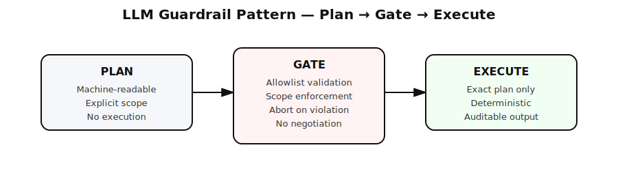

# LLM Guardrail Pattern: Plan → Gate → Execute

**LLMs are powerful, but unsafe by default as executors.**  
This repository demonstrates a minimal guardrail pattern that prevents
scope creep, unintended changes, and “helpful” initiative in AI-assisted workflows.

This is **not a framework**.  
It’s a **process-level safety mechanism**.

---

## The Problem

In real engineering workflows, LLM failures rarely look like hallucinations.

They look like:
- modifying files outside the requested scope
- reinterpreting a clearly defined task
- introducing “improvements” that were never asked for
- taking initiative without owning the consequences

This creates **operational risk**, not just bad output.

---

## Core Principle

> **Initiative without responsibility is a systems failure.**

LLMs do not:
- own downtime
- pay rollback costs
- experience production incidents

Therefore, they must be treated as **untrusted executors**.

---

## The Pattern

Plan → Gate → Execute

### 1. Plan
The model must first produce an explicit execution plan (JSON).
No execution is allowed without a validated plan.

### 2. Gate
A small validator enforces:
- allowed operations only
- allowed file paths only
- explicit scope boundaries

Any violation → **abort**.

### 3. Execute
Only after the plan passes the gate is the model allowed to perform changes,
and **only exactly as defined in the plan**.

---

## What This Prevents

- accidental refactors
- hidden scope expansion
- “helpful” but destructive initiative
- silent contract drift
- changes that are hard to audit or roll back

---

## Minimal Example

The repository includes:
- `gate.py` — a tiny preflight validator (~50 lines)
- `LLM_EXECUTION_CONTRACT.md` — explicit rules for model behavior

This is intentionally minimal.
If it needs to be complex, it’s already too late.

---

## Why This Exists

This pattern exists because:
- prompting alone is not a safety mechanism
- trust is not a control
- alignment is not enforcement

**Constraints are enforcement.**

---

## Who This Is For

- engineers using LLMs in real codebases
- teams integrating AI into CI / automation
- anyone who has already paid the cost of a bad AI decision

If you haven’t hit this problem yet — you probably will.

---

## Status

This is a reference pattern.
Use it, adapt it, or ignore it.

The system will decide later who was right.

